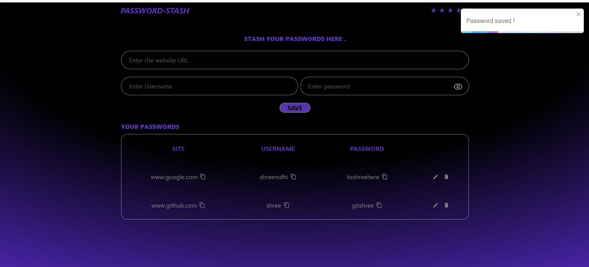

# Password Stash

A full-stack password manager built with React, Node.js, Express.js, and MongoDB. The application allows authenticated users to securely store and manage website credentials, with support for adding, editing, deleting, searching, and copying passwords.

The application implements JWT-based authentication using HttpOnly cookies, bcrypt password hashing for user accounts, AES-256-GCM encryption for stored credentials, and user-specific authorization to prevent unauthorized access to stored data.

## Live Demo

**Application:** https://stash-your-passwords.onrender.com/

---

## Features

- User registration and login
- JWT-based authentication using HttpOnly cookies
- User-specific authorization for stored credentials
- Bcrypt hashing for user account passwords
- AES-256-GCM encryption for stored website passwords
- Add new website credentials
- Edit existing credentials
- Delete stored credentials
- Search saved credentials
- Copy website, username, and password to clipboard
- Show/Hide password functionality
- Secure password generation
- Responsive UI for desktop and mobile devices
- Toast notifications for user actions
- Cloud database using MongoDB Atlas
- Full-stack deployment with React and Express served from a single application

---

## Tech Stack

### Frontend

- React.js
- Vite
- Tailwind CSS
- React Icons
- Lucide React
- React Toastify

### Backend

- Node.js
- Express.js
- JSON Web Token (JWT)
- bcrypt
- cookie-parser
- Node.js Crypto

### Database

- MongoDB Atlas

### Security

- JWT Authentication
- HttpOnly Cookies
- bcrypt Password Hashing
- AES-256-GCM Encryption
- Per-user Authorization

### Deployment

- Render
- MongoDB Atlas

---

## Project Structure

    Password Manager/
    │
    ├── BACKEND/
    │   ├── index.js
    │   ├── package.json
    │   └── package-lock.json
    │
    ├── FRONTEND/
    │   ├── src/
    │   ├── public/
    │   ├── package.json
    │   └── package-lock.json
    │
    ├── .gitignore
    ├── README.md
    └── image.png

---

## Installation

### 1. Clone the repository

    git clone https://github.com/ShreenidhiRaju/stash-your-passwords.git
    cd stash-your-passwords

### 2. Backend Setup

    cd BACKEND
    npm install

Create a `.env` file inside the `BACKEND` directory:

    MONGODB_URI=your_mongodb_connection_string
    JWT_SECRET=your_jwt_secret
    ENCRYPTION_KEY=your_base64_encoded_encryption_key

Run the backend:

    node index.js

---

### 3. Frontend Setup

Open a new terminal and navigate to the frontend:

    cd FRONTEND
    npm install

Create a `.env` file inside the `FRONTEND` directory:

    VITE_API_URL=http://localhost:3000

Run the frontend:

    npm run dev

---

## Authentication and Security

### User Authentication

Users can register and log in using an email and password.

User account passwords are hashed using bcrypt before being stored in MongoDB. The original password is never stored directly.

### JWT Authentication

After successful login, the backend generates a JSON Web Token containing the authenticated user's identity.

The token is stored in an HttpOnly cookie, preventing client-side JavaScript from directly accessing the authentication token.

### Authorization

Each stored credential is associated with the user who created it.

Protected operations verify both the credential ID and the authenticated user's ID before allowing access, modification, or deletion.

This ensures that an authenticated user can only access their own stored credentials.

### Credential Encryption

Website passwords need to be retrieved when the user accesses their credentials, so they are encrypted rather than hashed.

Password Stash uses AES-256-GCM to encrypt stored website passwords before they are persisted in MongoDB.

The encryption key is stored as an environment variable and is not committed to the repository.

---

## API Endpoints

### Authentication

| Method | Endpoint | Description |
|--------|----------|-------------|
| POST | `/api/auth/register` | Register a new user |
| POST | `/api/auth/login` | Authenticate a user |
| POST | `/api/auth/logout` | Log out the current user |
| GET | `/api/auth/me` | Verify the current authentication session |

### Password Management

| Method | Endpoint | Description |
|--------|----------|-------------|
| GET | `/api/passwords` | Retrieve the authenticated user's credentials |
| POST | `/api/passwords` | Store a new credential |
| PUT | `/api/passwords` | Update an existing credential |
| DELETE | `/api/passwords` | Delete an existing credential |

All password management endpoints require authentication.

---

## Deployment

The application is deployed as a full-stack application on Render.

The Express backend serves the production-built React frontend while also handling the REST API.

### Production Architecture

    Render
       │
       ├── React Frontend
       │      │
       │      └── Vite production build
       │
       └── Express Backend
              │
              └── MongoDB Atlas

The React application is built using:

    npm run build

Vite generates the production frontend inside the `FRONTEND/dist` directory. Express serves these generated files while handling API requests under the `/api` routes.

---

## Screenshots

---

## Future Enhancements

- Password strength analysis
- Password categories and favorites
- Password breach detection
- Export and import functionality
- Multi-factor authentication
- Session management
- Improved password generation options
- Rate limiting for authentication endpoints

---

## Security Considerations

This project is built for educational and portfolio purposes.

Application secrets such as the MongoDB connection string, JWT secret, and encryption key are stored using environment variables and are excluded from version control.

The application demonstrates fundamental authentication, authorization, password hashing, and encryption concepts but has not undergone a professional security audit and should not be used as a production password manager for sensitive real-world credentials.

---

## Author

**Shreenidhi Raju**

GitHub: https://github.com/ShreenidhiRaju
